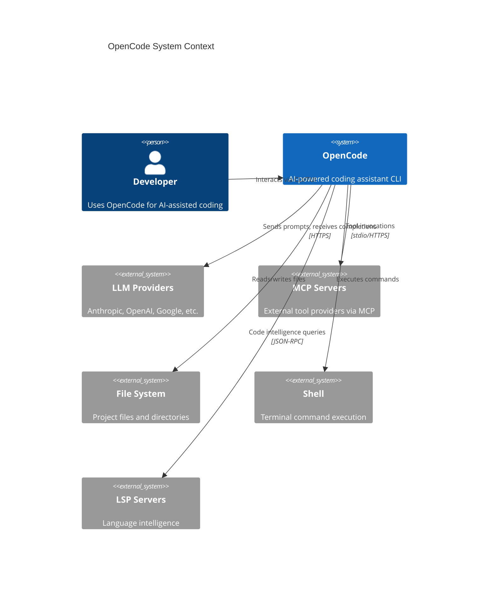
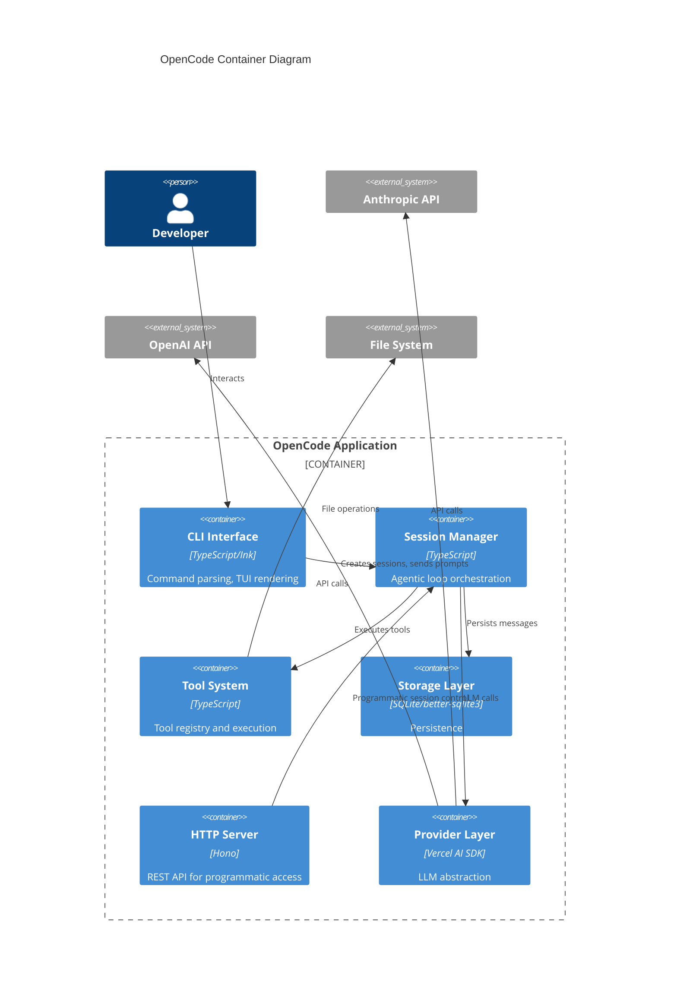
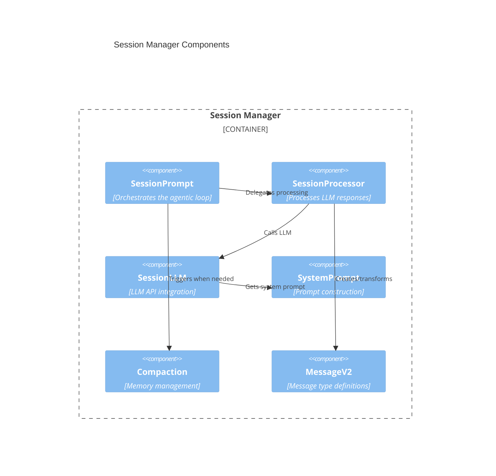
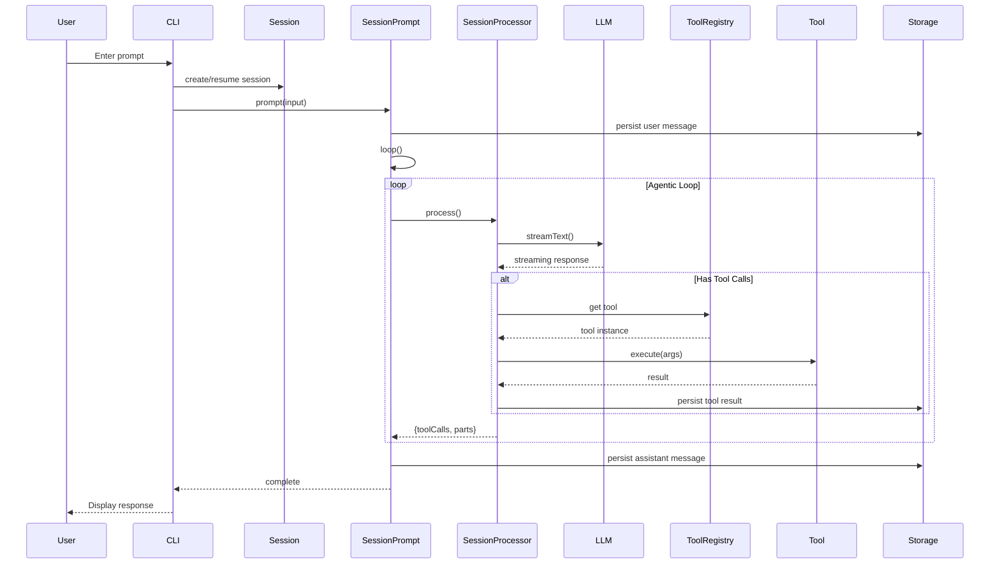
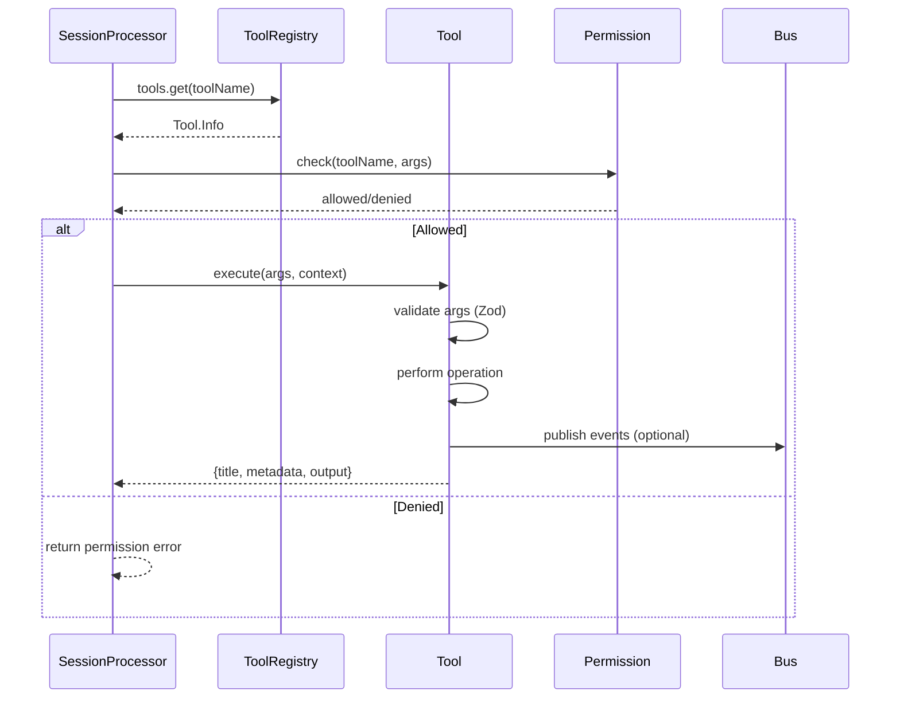

# OpenCode Architecture Document

> **Generated**: December 2024
> **Repository**: OpenCode - An AI-powered coding assistant CLI
> **Runtime**: TypeScript on Bun

---

## Table of Contents

1. [Conceptual Model](#1-conceptual-model)
2. [Codebase Architecture](#2-codebase-architecture)
3. [Low-Level Implementation Details](#3-low-level-implementation-details)
4. [If I Had to Modify This](#4-if-i-had-to-modify-this)
5. [Unknowns and Gaps](#5-unknowns-and-gaps)

---

## 1. Conceptual Model

### 1.1 The Agentic Loop

OpenCode implements a **streaming agentic loop** that continuously processes user prompts, invokes LLM completions, executes tools, and iterates until the model signals completion.

**Core Loop Flow:**

```
User Input → SessionPrompt.prompt() → SessionPrompt.loop() → SessionProcessor.process()
                                              ↓
                                    ┌─────────────────────┐
                                    │  LLM Streaming Call │
                                    └─────────────────────┘
                                              ↓
                                    ┌─────────────────────┐
                                    │  Tool Execution     │
                                    │  (if tool_use)      │
                                    └─────────────────────┘
                                              ↓
                                    ┌─────────────────────┐
                                    │  Continue Loop?     │──→ Yes: iterate
                                    │  (toolCalls.length) │
                                    └─────────────────────┘
                                              ↓ No
                                           Return
```

**Key implementation**: `packages/opencode/src/session/prompt.ts:95-141`

The loop terminates when:
1. No tool calls are returned by the model
2. An abort signal is received
3. The session is locked by another process

### 1.2 Memory System

OpenCode uses a **dual-layer memory architecture**:

| Layer | Purpose | Implementation |
|-------|---------|----------------|
| **Short-term** | Conversation messages within a session | In-memory array, persisted to SQLite |
| **Long-term** | Session history, share links, installation state | SQLite database via `better-sqlite3` |

**Memory Compaction** (`packages/opencode/src/session/compaction.ts`):
- Triggers when token count exceeds `PRUNE_MINIMUM` (20,000 tokens)
- Protects recent messages up to `PRUNE_PROTECT` (40,000 tokens)
- Uses LLM to generate summaries of pruned content
- Replaces verbose tool outputs with "[content pruned, see summary]"

```typescript
// Compaction constants (compaction.ts:6-7)
const PRUNE_MINIMUM = 20_000
const PRUNE_PROTECT = 40_000
```

### 1.3 Tool System

Tools are first-class citizens defined via a registry pattern:

```typescript
// Tool definition interface (tool/tool.ts:44-69)
Tool.define<Parameters, Metadata>(
  id: string,
  init: (ctx?) => Promise<{
    description: string
    parameters: ZodSchema
    execute(args, ctx): Promise<{ title, metadata, output, attachments? }>
  }>
)
```

**Tool Categories:**
- **Built-in tools**: File operations, shell execution, web fetch, etc.
- **MCP tools**: External tools via Model Context Protocol
- **Agent-specific tools**: Tools conditionally loaded based on active agent

### 1.4 Subagent / Delegation Pattern

OpenCode supports **subagent delegation** via the `Task` tool (`packages/opencode/src/tool/task.ts`):

- Creates isolated child sessions with their own conversation context
- Child agents can have different capabilities/tools than parent
- Results are returned to parent session as tool output
- Uses same LLM provider as parent session

**Subagent Types** (defined in `packages/opencode/src/agent/agent.ts`):
- `coder`: Primary coding agent with full tool access
- `task`: Background task execution agent
- `title`: Generates session titles
- `summarizer`: Creates conversation summaries

### 1.5 Prompt Construction

System prompts are assembled from multiple sources (`packages/opencode/src/session/system.ts`):

```typescript
// System prompt assembly (system.ts:30-70)
const parts = [
  agent.system,           // Agent-specific instructions
  skillPrompts,           // Active skill prompts
  projectContext,         // Project-specific context
  toolDescriptions,       // Available tool documentation
  environmentInfo,        // Runtime environment details
]
```

### 1.6 Model Provider Abstraction

OpenCode uses **Vercel AI SDK** (`ai` package) as its provider abstraction layer:

```typescript
// Provider registry (provider/provider.ts)
createProviderRegistry({
  anthropic: createAnthropic(),
  openai: createOpenAI(),
  google: createGoogleGenerativeAI(),
  // ... additional providers
})
```

**Supported Providers:**
| Provider | Package | Notes |
|----------|---------|-------|
| Anthropic | `@ai-sdk/anthropic` | Primary/default |
| OpenAI | `@ai-sdk/openai` | GPT-4, GPT-4o |
| Google | `@ai-sdk/google` | Gemini models |
| AWS Bedrock | `@ai-sdk/amazon-bedrock` | Claude on AWS |
| Azure | `@ai-sdk/azure` | OpenAI on Azure |
| xAI | `@ai-sdk/xai` | Grok models |
| Groq | `@ai-sdk/groq` | Fast inference |

### 1.7 Safety Rails and Termination

**Abort Handling:**
- Every tool context receives an `AbortSignal` (`tool/tool.ts:18`)
- Sessions can be aborted via `Session.abort()` API
- Graceful shutdown on SIGINT/SIGTERM

**Rate Limiting & Retries:**
- Provider-level rate limiting handled by Vercel AI SDK
- Exponential backoff on transient errors
- Maximum retry count configurable per provider

### 1.8 End-to-End Walkthrough

**User types: "Create a hello world function"**

1. **CLI receives input** (`cli/cmd/run.ts`)
   - Creates or resumes session
   - Calls `SessionPrompt.prompt(input)`

2. **Message stored** (`session/prompt.ts:52-68`)
   - User message persisted to SQLite
   - `SessionPrompt.loop()` initiated

3. **System prompt assembled** (`session/system.ts`)
   - Agent instructions + tools + context combined

4. **LLM call** (`session/llm.ts`)
   - `streamText()` called with full message history
   - Response streamed back

5. **Response processed** (`session/processor.ts`)
   - Text parts extracted and displayed
   - Tool calls identified

6. **Tool execution** (if any)
   - Tools executed in parallel where possible
   - Results added to message history
   - Loop continues from step 4

7. **Completion**
   - Final response with no tool calls
   - Assistant message persisted
   - Control returned to CLI

---

## 2. Codebase Architecture

### 2.1 Repository Structure

```
opencode/
├── packages/
│   └── opencode/                    # Main application package
│       ├── bin/opencode             # CLI entrypoint (shebang script)
│       ├── src/
│       │   ├── index.ts             # Public API exports
│       │   ├── agent/               # Agent definitions and management
│       │   ├── app/                 # TUI application (Ink/React)
│       │   ├── bus/                 # Event pub/sub system
│       │   ├── cli/                 # CLI commands and argument parsing
│       │   ├── config/              # Configuration management
│       │   ├── file/                # File system operations
│       │   ├── lsp/                 # Language Server Protocol client
│       │   ├── mcp/                 # Model Context Protocol integration
│       │   ├── permission/          # Permission system
│       │   ├── project/             # Project context management
│       │   ├── provider/            # LLM provider abstraction
│       │   ├── server/              # HTTP API server (Hono)
│       │   ├── session/             # Core session/conversation logic
│       │   ├── skill/               # Skill/plugin system
│       │   ├── storage/             # SQLite persistence layer
│       │   ├── tool/                # Tool registry and definitions
│       │   └── util/                # Shared utilities
│       └── drizzle/                 # Database migrations
├── www/                             # Documentation website
└── bun.lockb                        # Bun lockfile
```

### 2.2 Component Responsibilities

| Component | Primary File(s) | Responsibility |
|-----------|-----------------|----------------|
| **Session Orchestrator** | `session/prompt.ts` | Runs agentic loop, coordinates LLM calls and tool execution |
| **LLM Integration** | `session/llm.ts` | Wraps Vercel AI SDK for streaming/non-streaming calls |
| **Tool Registry** | `tool/registry.ts` | Discovers and initializes available tools |
| **Storage Layer** | `storage/storage.ts` | SQLite operations, migrations, queries |
| **Provider Manager** | `provider/provider.ts` | Model provider abstraction and selection |
| **Event Bus** | `bus/index.ts` | Instance-scoped pub/sub for events |
| **Project Context** | `project/instance.ts` | Manages per-directory instance state |
| **Configuration** | `config/config.ts` | Loads and validates user configuration |
| **CLI Interface** | `cli/cmd/*.ts` | Command parsing and execution |
| **HTTP Server** | `server/server.ts` | REST API for remote/programmatic access |

### 2.3 C4 Context Diagram



### 2.4 C4 Container Diagram



### 2.5 Component Diagram



### 2.6 Sequence Diagram: User Prompt Flow



### 2.7 Sequence Diagram: Tool Execution



---

## 3. Low-Level Implementation Details

### 3.1 Entrypoints

| Entrypoint | File | Purpose |
|------------|------|---------|
| CLI Binary | `packages/opencode/bin/opencode` | Shebang script invoking Bun |
| CLI Commands | `packages/opencode/src/cli/cmd/*.ts` | Individual command implementations |
| HTTP Server | `packages/opencode/src/server/server.ts` | REST API entrypoint |
| SDK Export | `packages/opencode/src/index.ts` | Programmatic API |

**CLI Entrypoint** (`bin/opencode`):
```sh
#!/usr/bin/env bun
import "../src/cli"
```

**Main CLI Setup** (`src/cli/index.ts`):
- Uses `yargs` for argument parsing
- Registers commands: `run`, `config`, `share`, `mcp`, etc.

### 3.2 Orchestrator (Session Loop)

**File**: `packages/opencode/src/session/prompt.ts`

```typescript
// Core loop implementation (lines 95-141)
async function loop(sessionID: string, opts: LoopOptions) {
  while (true) {
    const locked = await Session.lock.acquire(sessionID)
    if (!locked) throw new Error("Session locked")

    try {
      const result = await SessionProcessor.process({ sessionID, ...opts })

      if (result.aborted) break
      if (!result.toolCalls.length) break  // No more tool calls = done

      // Continue loop with tool results
    } finally {
      Session.lock.release(sessionID)
    }
  }
}
```

**Key Functions:**
- `SessionPrompt.prompt()` - Entry point for user messages
- `SessionPrompt.loop()` - Main agentic loop
- `SessionPrompt.retry()` - Retry last failed operation
- `SessionPrompt.revert()` - Undo last assistant turn

### 3.3 Prompt Builder

**File**: `packages/opencode/src/session/system.ts`

The system prompt is constructed dynamically:

```typescript
// Prompt assembly (lines 30-70, approximate)
export async function build(opts: BuildOptions): Promise<string> {
  const parts: string[] = []

  // 1. Agent base instructions
  parts.push(agent.system)

  // 2. Active skills
  for (const skill of activeSkills) {
    parts.push(await skill.getPrompt())
  }

  // 3. Project context
  if (project.context) {
    parts.push(project.context)
  }

  // 4. Environment info
  parts.push(formatEnvironment())

  return parts.join("\n\n")
}
```

### 3.4 Tool Registry

**File**: `packages/opencode/src/tool/registry.ts`

```typescript
// Tool discovery and initialization
export const ToolRegistry = {
  async tools(ctx: InitContext): Promise<Map<string, Tool.Info>> {
    const tools = new Map()

    // Built-in tools
    for (const tool of builtinTools) {
      const initialized = await tool.init(ctx)
      tools.set(tool.id, initialized)
    }

    // MCP tools (external)
    const mcpTools = await MCP.getTools()
    for (const tool of mcpTools) {
      tools.set(tool.id, tool)
    }

    return tools
  }
}
```

**Built-in Tools** (from `tool/` directory):
| Tool | File | Description |
|------|------|-------------|
| `bash` | `bash.ts` | Shell command execution |
| `file_read` | `file.ts` | Read file contents |
| `file_write` | `file.ts` | Write/create files |
| `file_edit` | `edit.ts` | Edit file sections |
| `glob` | `glob.ts` | File pattern matching |
| `grep` | `grep.ts` | Content search |
| `task` | `task.ts` | Subagent delegation |
| `web_fetch` | `web.ts` | HTTP requests |

### 3.5 Memory / Persistence Layer

**File**: `packages/opencode/src/storage/storage.ts`

Uses `better-sqlite3` for synchronous SQLite operations:

```typescript
// Database initialization
const db = new Database(path.join(dataDir, "opencode.db"))
db.pragma("journal_mode = WAL")

// Run migrations
await migrate(db, migrationsFolder)
```

**Tables** (inferred from migrations in `drizzle/`):
- `sessions` - Session metadata
- `messages` - Conversation messages (JSON blob)
- `shares` - Shared session links
- `installations` - MCP server installations

**Message Storage Format** (`session/message-v2.ts`):
```typescript
interface MessageV2 {
  id: string
  role: "user" | "assistant" | "tool"
  parts: MessagePart[]
  metadata: { ... }
  createdAt: Date
}
```

### 3.6 LLM Provider Integration

**File**: `packages/opencode/src/provider/provider.ts`

```typescript
// Provider registry setup
export const registry = createProviderRegistry({
  anthropic: createAnthropic({ apiKey: config.anthropic?.apiKey }),
  openai: createOpenAI({ apiKey: config.openai?.apiKey }),
  google: createGoogleGenerativeAI({ apiKey: config.google?.apiKey }),
  // ... more providers
})

// Model resolution
export function getModel(modelId: string): LanguageModel {
  return registry.languageModel(modelId)
}
```

**LLM Call** (`session/llm.ts`):
```typescript
// Streaming call
const result = await streamText({
  model: getModel(modelId),
  messages: formattedMessages,
  system: systemPrompt,
  tools: toolDefinitions,
  maxTokens: config.maxTokens,
  temperature: config.temperature,
})

// Process stream
for await (const chunk of result.stream) {
  // Handle text deltas, tool calls, etc.
}
```

### 3.7 Key Data Types

**Session** (`session/index.ts`):
```typescript
interface Session.Info {
  id: string
  title: string
  agent: string
  modelId: string
  createdAt: Date
  updatedAt: Date
}
```

**Message** (`session/message-v2.ts`):
```typescript
interface MessageV2 {
  id: string
  sessionId: string
  role: "user" | "assistant"
  parts: (TextPart | ToolCallPart | ToolResultPart | FilePart)[]
  createdAt: Date
}
```

**Tool Context** (`tool/tool.ts:14-22`):
```typescript
interface Tool.Context {
  sessionID: string
  messageID: string
  agent: string
  abort: AbortSignal
  callID?: string
  extra?: Record<string, any>
  metadata(input: { title?: string; metadata?: any }): void
}
```

### 3.8 Error Handling

**Tool Validation Errors** (`tool/tool.ts:54-64`):
```typescript
try {
  toolInfo.parameters.parse(args)
} catch (error) {
  if (error instanceof z.ZodError && toolInfo.formatValidationError) {
    throw new Error(toolInfo.formatValidationError(error), { cause: error })
  }
  throw new Error(
    `The ${id} tool was called with invalid arguments: ${error}.`,
    { cause: error }
  )
}
```

**LLM Errors** - Handled by Vercel AI SDK with retry logic

**Abort Handling** - Propagated via `AbortSignal` through tool context

### 3.9 Logging and Observability

**File**: `packages/opencode/src/util/log.ts`

```typescript
// Structured logging
const log = Log.create({ service: "session" })
log.info("processing", { sessionId, messageCount })
log.error("tool failed", { toolId, error })
```

**Event Bus** (`bus/index.ts`) for internal observability:
```typescript
Bus.publish(SessionEvent.MessageCreated, { sessionId, messageId })
Bus.subscribe(SessionEvent.MessageCreated, (event) => { ... })
```

---

## 4. If I Had to Modify This

### 4.1 Adding a New Tool

1. **Create tool file**: `packages/opencode/src/tool/my-tool.ts`
```typescript
import { Tool } from "./tool"
import z from "zod"

export const MyTool = Tool.define(
  "my_tool",
  {
    description: "Does something useful",
    parameters: z.object({
      input: z.string().describe("The input to process"),
    }),
    async execute(args, ctx) {
      // Implementation
      return {
        title: "My Tool",
        metadata: {},
        output: `Processed: ${args.input}`,
      }
    },
  }
)
```

2. **Register in registry**: `packages/opencode/src/tool/registry.ts`
```typescript
import { MyTool } from "./my-tool"
// Add to builtinTools array
```

### 4.2 Adding a New LLM Provider

1. **Install SDK package**: Add to `packages/opencode/package.json`
```json
"@ai-sdk/new-provider": "^1.0.0"
```

2. **Register provider**: `packages/opencode/src/provider/provider.ts`
```typescript
import { createNewProvider } from "@ai-sdk/new-provider"

export const registry = createProviderRegistry({
  // ... existing providers
  newprovider: createNewProvider({ apiKey: config.newprovider?.apiKey }),
})
```

3. **Add config schema**: `packages/opencode/src/config/config.ts`
```typescript
newprovider: z.object({
  apiKey: z.string().optional(),
}).optional()
```

### 4.3 Adding a New Memory Backend

**Currently**: SQLite only (`storage/storage.ts`)

**To add alternative (e.g., PostgreSQL)**:

1. Create new storage adapter: `packages/opencode/src/storage/postgres.ts`
2. Implement same interface as SQLite storage
3. Add configuration option for storage backend selection
4. Update `storage/storage.ts` to delegate to selected backend

**Key interfaces to implement**:
- `sessions.create()`, `sessions.get()`, `sessions.list()`
- `messages.create()`, `messages.list()`, `messages.update()`
- `shares.create()`, `shares.get()`

### 4.4 Adding a New Agent Type

1. **Define agent**: `packages/opencode/src/agent/agent.ts`
```typescript
export const myAgent: Agent.Info = {
  id: "my-agent",
  name: "My Custom Agent",
  system: `You are a specialized agent for...`,
  tools: ["tool1", "tool2"],  // Allowed tools
}
```

2. **Register**: Add to agents array in same file

### 4.5 Modifying Prompt Construction

**File**: `packages/opencode/src/session/system.ts`

Key modification points:
- Line ~30: Add new prompt sections
- Skill integration: `packages/opencode/src/skill/`
- Agent-specific prompts: `packages/opencode/src/agent/agent.ts`

---

## 5. Unknowns and Gaps

### 5.1 Areas Requiring Further Investigation

| Area | Question | Files to Explore |
|------|----------|------------------|
| **MCP Protocol** | Full message format and handshake details | `src/mcp/` directory |
| **Permission System** | Exact permission rules and persistence | `src/permission/` |
| **LSP Integration** | How LSP is used for code intelligence | `src/lsp/` |
| **TUI Framework** | Ink/React component architecture | `src/app/` |
| **Share System** | How session sharing works | `src/share/` (if exists) |

### 5.2 Unverified Assumptions

1. **Retry behavior**: Assumed exponential backoff, but exact implementation not traced
2. **Token counting**: Assumed tiktoken or similar, but tokenizer not explicitly identified
3. **Streaming protocol**: Assumed SSE for HTTP server, not verified
4. **Concurrent tool execution**: Parallel execution mentioned but limits not identified

### 5.3 Missing from Analysis

- **Test coverage**: Test files not analyzed
- **Build/deployment**: CI/CD configuration not reviewed
- **Performance characteristics**: No profiling data
- **Security model**: Permission system not fully traced
- **Plugin/skill authoring**: Skill creation documentation not found

### 5.4 Potential Architectural Risks

1. **Single SQLite database**: May become bottleneck at scale
2. **In-memory message cache**: Large conversations could cause memory pressure
3. **Synchronous SQLite**: `better-sqlite3` is sync; could block event loop in edge cases
4. **Global state via Instance**: Instance pattern could complicate testing/parallelism

---

## Appendix: File Reference

| Category | Key Files |
|----------|-----------|
| Entrypoints | `bin/opencode`, `src/cli/index.ts`, `src/server/server.ts` |
| Core Loop | `src/session/prompt.ts`, `src/session/processor.ts` |
| LLM | `src/session/llm.ts`, `src/provider/provider.ts` |
| Tools | `src/tool/tool.ts`, `src/tool/registry.ts`, `src/tool/*.ts` |
| Storage | `src/storage/storage.ts`, `drizzle/*.sql` |
| Config | `src/config/config.ts` |
| Events | `src/bus/index.ts`, `src/bus/bus-event.ts` |
| Agents | `src/agent/agent.ts` |

---

*Document generated by analyzing the OpenCode repository. For the most current architecture, always refer to the source code.*
